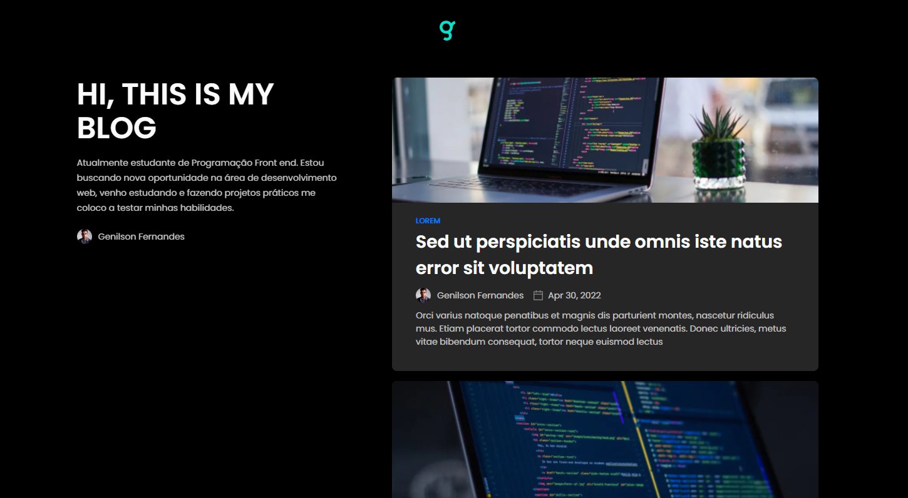

# Blog feito com Next e GraphCMS | PROJETO PARA ESTUDO

## Sobre o Projeto

Compartilhando mais um estudo de um dessa vez de um blog, feito com Next-js, e com consumo de uma API com graphQl feita com o graphcms e , resultado pode ver ai no links e no vídeo abaixo.

